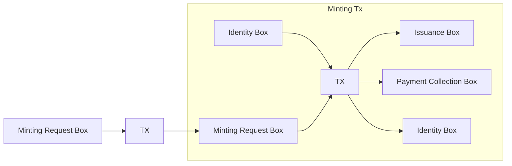

# Glossary

### Minting Contract
A script for validating that every mint follows a few rules: 
- That certain inputs to the minting tx are in a certain order
- That the token being minted has the same name specified in the minting request box
- That the NFT is sent to the receiver address specified in the minting request box
- That ErgoNames is collecting the expected payment amount

### Identity Box
A box meant to establish a consistent ErgoNames minting address, or artist identity per [EIP-24](https://github.com/ergoplatform/eips/blob/master/eip-0024.md#artist-identity). It should come from the official ErgoNames minting address, and specify the royalty percentage to collect from secondary market sales in R4.

It is expected to be the first input to the minting tx.
It is also expected to be an output that returns to the ErgoNames minting address.

### Minting Request Box
A box representing a request to mint an ergoname. It holds some data in its registers for the minting contract to validate.

- R4: Coll[Byte] - ergoname to mint
- R5: Long - Expected payment amount in nanoergs
- R6: Coll[Byte] - Receiver address

It is expected to be the second input to the minting tx.

### Issuance Box
A box abiding by [EIP-4](https://github.com/ergoplatform/eips/blob/master/eip-0004.md) standard, containing the newly minted ergoname.

It is expected to be sent to the receiver address specified in R6 of the minting request box.

### Payment Collection Box
A box that _should_ whose value should equal the amount specified in R5 of the minting request box.

It is expected to be sent to the ErgoNames payments wallet.

# Minting Flow

