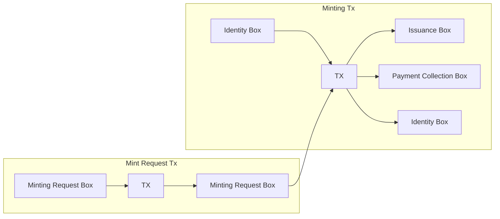

# Glossary

### Minting Contract
A script for validating that every mint follows a few rules: 
- That certain inputs to the minting tx are in a certain order
- That the token being minted has the same name specified in the minting request box
- That the NFT is sent to the receiver address specified in the minting request box
- That ErgoNames is collecting the expected payment amount

### Identity Box
A box meant to establish a consistent ErgoNames minting address, or artist identity per [EIP-24](https://github.com/ergoplatform/eips/blob/master/eip-0024.md#artist-identity). It should come from the official ErgoNames minting address, and specify the royalty percentage to collect from secondary market sales in R4.

It is expected to be the first input to the minting tx.
It is also expected to be an output that returns to the ErgoNames minting address.

### Minting Request Box
A box representing a request to mint an ergoname. It holds payment along with some data in its registers for the minting contract to validate.

- R4: Coll[Byte] - ergoname to mint
- R5: Long - Expected payment amount in nanoergs
- R6: Coll[Byte] - Receiver address

We build this box on behalf of the user in the transaction that sends payment to the minting contract.

It is expected to be the second input to the minting tx.

### Issuance Box
A box abiding by [EIP-4](https://github.com/ergoplatform/eips/blob/master/eip-0004.md) standard, containing the newly minted ergoname.

It is expected to be sent to the receiver address specified in R6 of the minting request box.

### Payment Collection Box
A box that _should_ whose value should equal the amount specified in R5 of the minting request box.

It is expected to be sent to the ErgoNames payments wallet.

### Minting Requests Queue
A queue backed by AWS SQS where minting request messages get published.

Messages in the queue trigger the minting handler.

### Minting Handler
A serverless function hosted in AWS Lambda that consumes messages from the minting requests queue.

When triggered, it runs the code for spending a minting request by ID and minting an ergoname. 

# Minting Flow

### Transactions breakdown
Minting an ergoname requires two transactions:
- One to submit the minting request box to the minting contract address
- Another one to spend the minting request box and issue the ergoname; this is a chained transaction.

We build the first transaction on behalf of the user, have them sign for it, and then submit it to the network. Upon successful submission of this transaction, we ping the ErgoNames API with the minting request box ID. The ErgoNames API then pushes a message with that minting request box ID to the minting requests queue. The minting handler will be invoked with this message, and it will build a transaction with the necessary inputs and outputs for minting the requested ergoname.

### Flowchart

